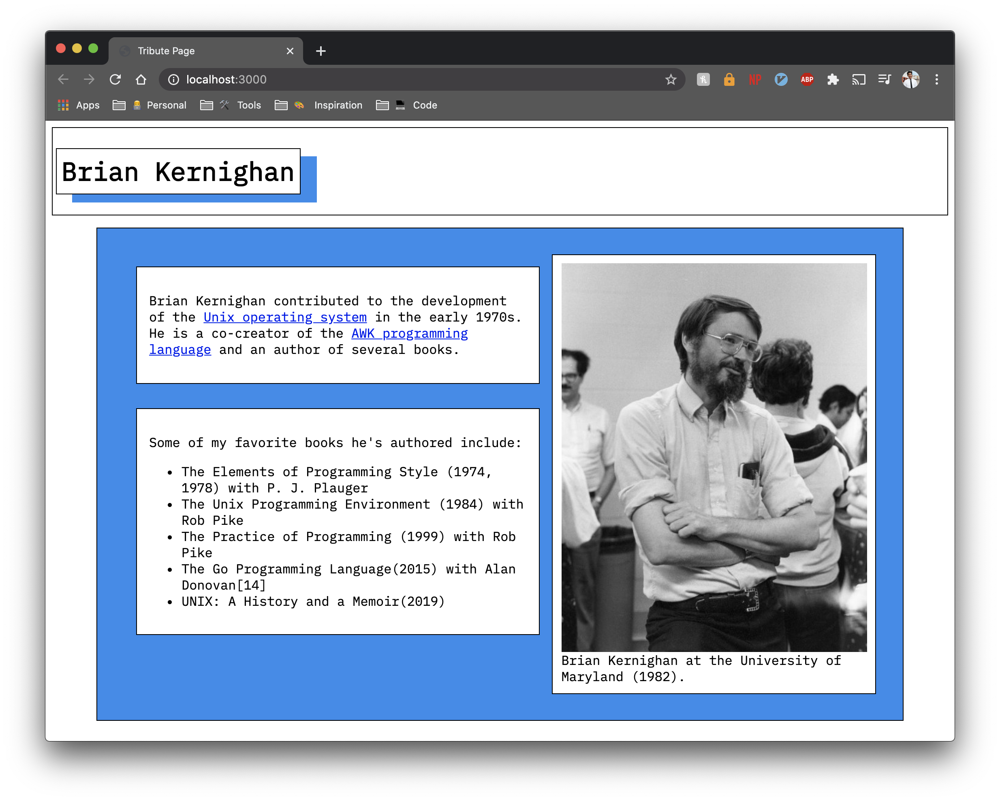

# My [FreeCodeCamp](https://www.freecodecamp.org/pineapplegiant) Tribute page!

I told myself a while back that I'd get these certifications, so here's me keeping that promise to myself. You can check all the projects on [codepen](https://codepen.io/collection/XPObaY). 

I like to develope here, since I think codepen is kinda lame. [C'est la vie](https://youtu.be/vQ0u09mFodw?t=115).

## Preview

    

## Tools used
* [Flexbox](https://css-tricks.com/snippets/css/a-guide-to-flexbox/)
* [Good vibes](https://pics.me.me/pwwwayffefssssshhiffeway-hey-check-out-haw-hard-i-can-vibe-wow-66710512.png)
